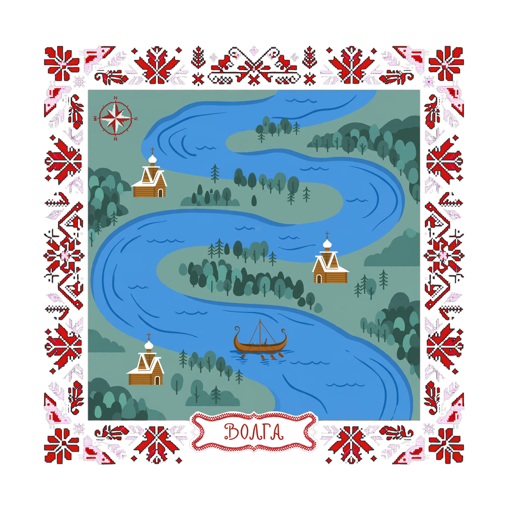
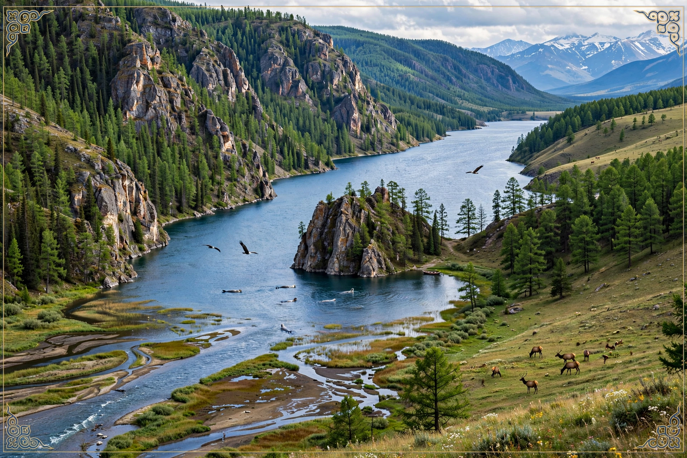

# Module 0: Geography and Environment — Day 1

## 1. Topic Preview & Warm-Up

**Topic:** География и окружающая среда

**Warm-up question(s):**

1. Что вы знаете о географии России?

2. Где находится Волга?

3. Чем известен север России?

## 2. Listening Comprehension — Passage 1

**Волга: символ России и самая большая река Европы**

### Pre-Listening

**Vocabulary:**

- **Возвышенность** – highland, elevated area
- **Заволжье** – region beyond the Volga (less commonly known term)
- **Поволжье** – Volga region
- **Дельта** – delta (river delta)
- **Приток** – tributary
- **Жемчужина** – pearl (used metaphorically as "gem" or "highlight")
- **Волок** – portage (route for transporting boats/cargo between rivers) [волочить = to drag]
- **Исток** – source
- **Родник** – spring
- **Устье** – mouth of a river

**Comprehension check (multiple choice):**

**1. What is the significance of the Volga River in Russia?**
   - A) It is a small river used mainly for fishing.
   - B) It symbolizes Russia and connects different regions.
   - C) It flows entirely within Tver Oblast.
   - D) It is the only river in Russia with a delta.

**2. What does the term "Заволжье" refer to?**
   - A) The upper forested part of the Volga
   - B) The low area on the opposite side of the Volga from the high right bank
   - C) The delta region of the Volga
   - D) The steppe region south of Samara

**3. Which feature of the Volga delta is highlighted in the text?**
   - A) Its network of canals
   - B) The Astrakhan lotus fields
   - C) The portage routes
   - D) The largest bridge

**4. Why is the Volga called the «главная улица» of Russia?**
   - A) Because it has the longest bridge in Europe
   - B) Because it historically served as a main transport and trade route
   - C) Because it flows exclusively through cities
   - D) Because it has many lotus fields

**5. What is stated in the segment about the Volga's role in Russian culture?**
   - A) It only serves multiple economic purposes.
   - B) It unites diverse peoples and regions of Russia.
   - C) It is a foremost tourist attraction.
   - D) It has no historical importance.

### Listening

<audio controls src="../../../assets/audio/m00-d1-l1-audio.mp3"></audio>

**Transcript:** Волга — символ России и самая большая река Европы. За 37 дней вода преодолевает путь от истока, родника в Тверской области до устья в Астраханской. Верхняя Волга — это густые леса Валдайской возвышенности. В среднем Поволжье особенно заметна разница между высоким правобережьем и низким Заволжьем. Южнее Самарской Луки начинаются степи Нижнего Поволжья.

Жемчужина дельты Волги — Астраханские лотосовые поля. Первый мост через Волгу длиной всего 3 метра, а самый большой в Ульяновске — почти 6 километров. Издавна Волгу называли «главной улицей» России. Сеть волоков, а позже каналов, соединяет её с Балтикой и Азовом. Самый крупный правый приток Ока - c Центральной Россией, самый большой левый приток — Кама, водный путь на Урал. Волга стала символом многонациональной России, объединив народы, живущие на её берегах.

[Watch on YouTube](https://youtu.be/uvHuSPyfAHE)

### Post-Listening

**Discussion questions:**

1. Что нового вы узнали о Волге?

2. Есть ли в вашей стране природный объект, который является ее "символом"?

3. Какие два способа связи Волги с морями упоминаются в отрывке?

## 3. Reading Comprehension — Passage 1

### Pre-Reading

**Warm-up question(s):**

1. Любите ли вы путешествовать?

2. Какие виды туризма вы предпочитаете и почему?

3. Какие города или страны вы хотели бы посетить и почему?

**Vocabulary:**

- **переживать бум** — to experience a boom; to become rapidly more popular
- **достойный маршрут** — a worthwhile route
- **покорять** — to conquer; to successfully complete a challenging route
- **горный серпантин** — a winding mountain road
- **велопоездка** — a bicycle trip
- **предгорье** — foothill
- **шаманский мыс** — shamanic cape
- **гравий** — gravel
- **сбавить давление** — to reduce the pressure
- **шина** — tire
- **переменчивая погода** — changeable weather
- **ветровка** — windbreaker
- **прогреваться** — to warm up
- **паром** — ferry
- **турбаза** — tourist base; holiday camp
- **источник** — water source
- **подстраиваться** — to adapt
- **закрепить вещи** — to fasten belongings securely
- **степь** — steppe; a vast, mostly treeless grassland in Eurasia, similar to a prairie
- **священный** — sacred; holy

**Comprehension check:**

**1. What is the approximate length of the route from Irkutsk to Olkhon?**
   - A. About 100 kilometers
   - B. About 200 kilometers
   - C. About 300 kilometers
   - D. About 500 kilometers

**2. Why do experienced cyclists advise reducing tire pressure on Olkhon?**
   - A. To ride faster on asphalt
   - B. To make riding on sand easier
   - C. To reduce the risk of being blown off course by strong winds
   - D. To prevent the tires from overheating during hot afternoons

**3. When does the text recommend taking this route around Lake Baikal?**
   - A. March–April
   - B. May–June
   - C. July–August
   - D. October–November

**4. Why is water mentioned in the route advice?**
   - A. Cyclists may have difficulty finding places to refill their drinking water.
   - B. Cyclists are reassured they can drink directly from Lake Baikal throughout the trip, since it is a source of the purest water on earth.
   - C. Cyclists need water to wash sand from their bicycles each evening.
   - D. Cyclists should be aware of the fact that even in summer water is cold in Baikal.

**5. Where does the text recommend staying on Olkhon Island?**
   - A. In the village of Khuzhir, since affordable hotels are available there
   - B. In central Irkutsk, since it has great infrastructure
   - C. At Cape Burkhan, since it is a scenic place
   - D. In the foothills near Lake Baikal, since there is an easy access to the lake

### Reading

*(Reading passage text to be added.)*

### Post-Reading

**Discussion questions:**

*(To be added.)*

## 4. Listening Comprehension — Passage 2

*(To be added.)*

## 5. Reading Comprehension — Passage 2

*(To be added.)*

## 6. Topical Discussion

*(Synthesizing questions that pull together both listening and reading passages — to be added.)*

## 7. Vocabulary Review

*(Info-gap and translation exercise reviewing vocabulary from today's passages — to be added.)*
